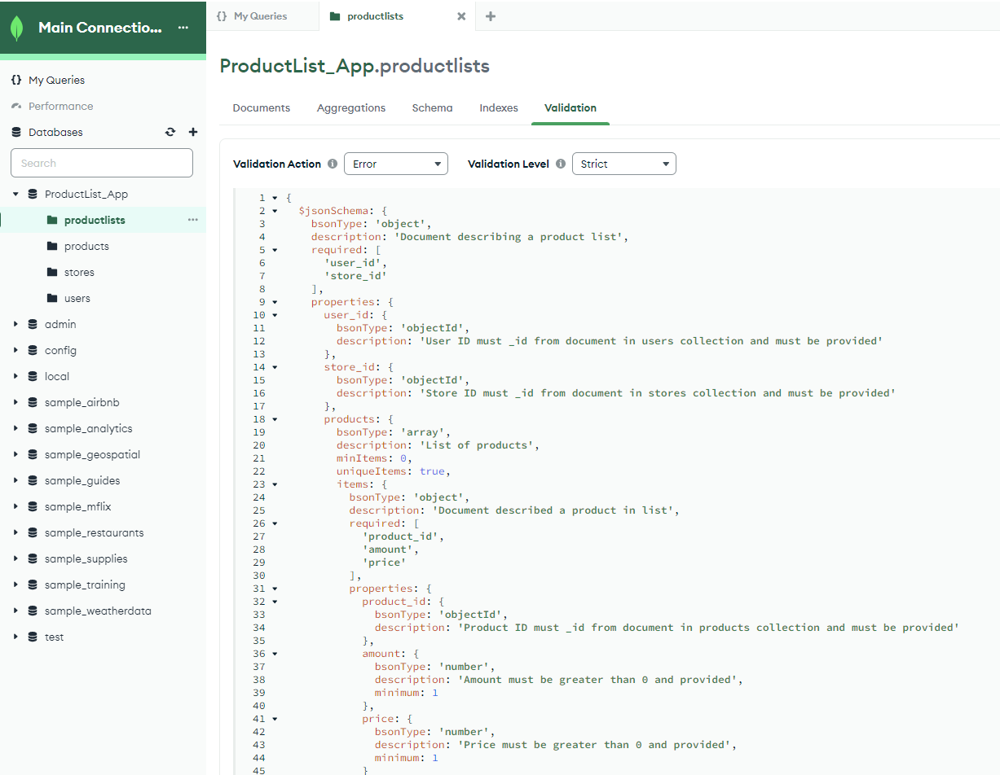
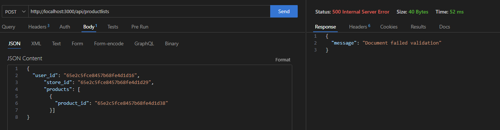

# Distinctiveness and Complexity
Product List API provide opportunity to Create, Read, Update, Delete users product lists. Created using ***Typescript***, **Node.js**, **Express.js**, and **Mongoose** technologies.

# Technical documentation of the project
## Code specification
### Files structure:
- **dist** - directory with compiled file
    - *server.js* - compiled js file
- **src** - directory with main code files
    - **config** - directory for configuration files
        - *db.config.ts* - config for connection to MongoBD by Mongoose framework
    - **controllers** - directory for controllers
        - *product.controllers.ts* - controller to operate with *product* routes and data
        - *productlist.controllers.ts* - controller to operate with *productlist* routes and data
        - *seed.controllers.ts* - controller to operate with *seed* route
        - *store.controllers.ts* - controller to operate with *store* routes and data
        - *user.controllers.ts* - controller to operate with *user* routes and data
    - **modules** - directory for mongoose schemas for every data collections
        - *product.models.ts* - schema for *products* collection
        - *productlist.models.ts* - schema for *productlists* collection
        - *store.models.ts* - schema for *stores* collection
        - *user.models.ts* - schema for *user* collection
    - **routes** - directory with routes
        - *product.routes.ts* - routes and CRUD operations for '/api/products' route
        - *productlist.routes.ts* - routes and CRUD operations for '/api/productlists' route
        - *store.routes.ts* - routes and CRUD operations for '/api/stores' route
        - *user.routes.ts* - routes and CRUD operations for '/api/users' route
    - **types** - directory with TypeScript custom types
        - *main.d.ts* - file with custom types and interfaces that used in projects
    - **utilities** - directory with helper functions and seeds data
        - *seed.data.ts* - file with seed data and helper functions to generate dependent documents
    - *server.ts* - main code source file for server
- *.env.example* - exsample file with environmental variables
- *package.json* - main properties of project
- **readme_info** - directory for readme extra information
### Main types and interfaces
Main types and interfaces that used in project located in `src/types/main.d.ts` file:
#### Interfaces
- **IUser** - represents user of application
- **IStore** - represents store that user could visit
- **IProduct** - represents product that user could add to list
- **IProductList** - represents product list that user could create
- **IUserList** - represents detailed information about all lists that user has
#### Types
- **TStore** - represents store that user could visit( we need it to create seed data)
- **TProductList** - represents product list that user could create ( we need it to create seed data)
- **WeekDay** - literal type for week days
- **DayWorkingHours** - represents store working hours in certain week day
- **Category** - literal type of product categories
- **ProductInfo** - detailed information about product in list
- **StoreList** - detailed information about user list 

## Installation
1. Clone repository. run `npm install` to get all dependencies
2. Create .env file according to .env.example structure. Add connection string to MongoDB database with your username/password. It is possible to create a free account in [MongoDB ](https://www.mongodb.com/) using **Try Free** option
3. Uncomment 27-28 lines in `server.ts` file to be abble to add test data to database
4. To run dev scripts use command `npm run dev`
5. Call `GET` method  using `/seed` route to create test data in database
6. Comment back 27-28 lines in `server.ts` file


## API user guide
There are few API routes and operations:
1. ### User API
 ##### Get All users
- API end point : `/api/users`
- API method: `GET`
- return object structure: 
```
{
"data": [
    "_id": "65e2c5fce8457b68fe4d1d14",
      "username": "carrier",
      "first_name": "Frodo",
      "last_name": "Baggins",
      "email": "f.beggins@shire.jrrt",
      "__v": 0
] }
```
##### Create new user
- API end point : `/api/users`
- API method: `POST`
- request body: 
```
{
"username": <userName>,
"first_name": <user first name>,
"last_name": <user Leat name>,
"email": <user email>
}
```
##### Get user by ID
- API end point : `/api/users/:id`
- API method: `GET`
- return object structure:
```
{
"data": {
"_id": <id>,
"username": <userName>,
"first_name": <user first name>,
"last_name": <user Leat name>,
"email": <user email>,
"__v": 0
}
}
```
##### Change user
- API end point : `/api/users/:id`
- API method: `PATCH`
- request body: any of object properties:
```
{
"first_name": <user first name>,
"last_name": <user Leat name>
}
```
##### Delete user
- API end point : `/api/users/:id`
- API method: `DELETE`

##### All user product lists
- API end point : `/api/users/:id/productlists`
- API method: `GET`
- Additional query selectors: `store` - filter only lists for selecter store name
2. ### Store API
 ##### Get All 
- API end point : `/api/stores`
- API method: `GET`
- return object structure: 
```
{
"data": [
    {
    "_id": "65e2c5fce8457b68fe4d1d1e",
      "name": "Costco",
      "address": "7725 188th Ave NE, Redmond, WA 98052",
      "working_hours": [
        {
          "week_day": "Saturday",
          "open": "9:30 AM",
          "close": "6 PM",
          "_id": "65e2c5fce8457b68fe4d1d1f"
        },
        {
          "week_day": "Sunday",
          "open": "10 AM",
          "close": "6 PM",
          "_id": "65e2c5fce8457b68fe4d1d20"
        }
      ],
      "__v": 0
    }
] }
```
##### Create new 
- API end point : `/api/stores`
- API method: `POST`
- request body: 
```
{
      "name": "<store name>",
      "address": "<store address>",
      "working_hours": [
        {
          "week_day": "<week day from WeekDay type>",
          "open": "<time>",
          "close": "<time>",
        }        
      ]
    }
```
##### Get  by ID
- API end point : `/api/stores/:id`
- API method: `GET`
- return object structure:
```
{
"data": {
    "id": <id>,
    "name": "<store name>",
    "address": "<store address>",
    "working_hours": [
        {
          "week_day": "<week day from WeekDay type>",
          "open": "<time>",
          "close": "<time>",
        }        
      ],
    "__v": 0
    }
}
```
##### Change
- API end point : `/api/stores/:id`
- API method: `PATCH`
- request body: any of object properties. If added `working_hours` object - API delete all existed objects and added new from `PATCH` request!:
```
{
    "name": "<store name>",
      "address": "<store address>",
      "working_hours": [
        {
          "week_day": "<week day from WeekDay type>",
          "open": "<time>",
          "close": "<time>",
        }        
      ]
}
```
##### Delete
- API end point : `/api/stores/:id`
- API method: `DELETE`

3. ### Product API
 ##### Get All 
- API end point : `/api/products`
- API method: `GET`
- return object structure: 
```
{
"data": [
    {
        "_id": "65e2c5fce8457b68fe4d1d39",
        "name": "Potato",
        "category": "Fruits & Vegetables",
        "__v": 0
    }
] }
```
##### Create new 
- API end point : `/api/products`
- API method: `POST`
- request body: 
```
{
    "name": "<product name>",
    "category": "<category from Category literal type>",
}
```
##### Get  by ID
- API end point : `/api/products/:id`
- API method: `GET`
- return object structure:
```
{
"data": {
        "_id": "65e2c5fce8457b68fe4d1d39",
        "name": "Potato",
        "category": "Fruits & Vegetables",
        "__v": 0
    }
}
```
##### Change
- API end point : `/products/:id`
- API method: `PATCH`
- request body: any of object properties:
```
{
    "name": "<product name>",
    "category": "<category from Category literal type>"
}
```
##### Delete
- API end point : `api/products/:id`
- API method: `DELETE`
4. ### Product List API
 ##### Get All 
- API end point : `/api/productlists`
- API method: `GET`
- return object structure: 
```
{
"data": [
    {
      "_id": "65e2c5fce8457b68fe4d1d52",
      "user_id": "65e2c5fce8457b68fe4d1d14",
      "store_id": "65e2c5fce8457b68fe4d1d21",
      "products": [
        {
          "product_id": "65e2c5fce8457b68fe4d1d3c",
          "amount": 90,
          "price": 15,
          "_id": "65e2c5fce8457b68fe4d1d53"
        } 
        ]
    }
] 
}
```
##### Create new 
- API end point : `/api/productlists`
- API method: `POST`
- request body: 
```
{
      "user_id": "<ObjectId - reference for user>",
      "store_id": "<ObjectID - reference for store>",
      "products": [
        {
          "product_id": "<ObjectID - reference for product>",
          "amount": <amount of products>,
          "price": <price for 1 unit of product>,
        } 
        ]
}
```
##### Get  by ID
- API end point : `/api/productlists/:id`
- API method: `GET`
- return object structure:
```
{
"data": {
      "_id": "65e2c5fce8457b68fe4d1d52",
      "user_id": "65e2c5fce8457b68fe4d1d14",
      "store_id": "65e2c5fce8457b68fe4d1d21",
      "products": [
        {
          "product_id": "65e2c5fce8457b68fe4d1d3c",
          "amount": 90,
          "price": 15,
          "_id": "65e2c5fce8457b68fe4d1d53"
        } 
        ]
    }
}
```
##### Change
- API end point : `/api/productlists/:id`
- API method: `PATCH`
- request body: any of object properties. If added `products` object - API delete all existed objects and added new from `PATCH` request!:
```
{
"user_id": "<ObjectId - reference for user>",
      "store_id": "<ObjectID - reference for store>",
      "products": [
        {
          "product_id": "<ObjectID - reference for product>",
          "amount": <amount of products>,
          "price": <price for 1 unit of product>,
        } 
        ]
}
```
##### Delete
- API end point : `/api/productlists/:id`
- API method: `DELETE`

# Author
Project prepared as a part of education in **Software Engineering Bootcamp** at *Per Scholas* by [Kseniia Irinarkhova](https://www.linkedin.com/in/kseniia-irinarkhova/).

# Additional Resources
- [Easy MongoDB Mongoose Connection with TypeScript Nodejs and Express](https://thriveread.com/mongodb-mongoose-connection-with-typescript-nodejs-and-express/)
- [Interfaces vs Types in TypeScript](https://blog.logrocket.com/types-vs-interfaces-typescript/)

# Additional Informaton for *Per Scholas* project submition
During development database validation was created.



As in project schema for `productlist` fields `amount` and `price` are not required, because of DB validation - system shows error:



-[script for MongoDB validation and template for POST body with errors](./readme_info/productlist.validation.txt)
